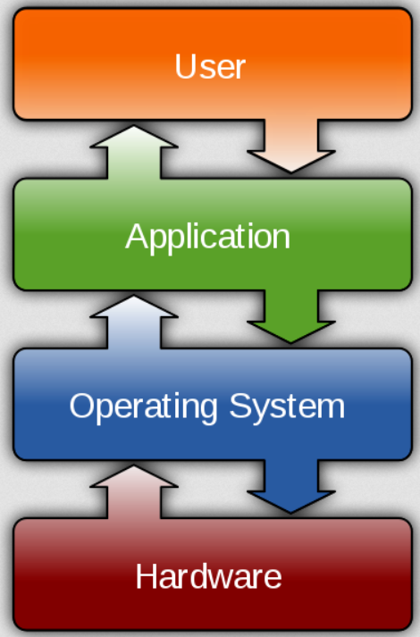
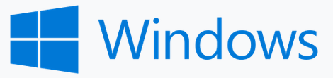

# Programming in scientific research

---

# About me

* Krzysztof Basiński (Chris)
* k.basinski@gumed.edu.pl
* Department of Psychology
* Tuwima 15, room 312

---

# About the course

* 15 times 2h classes
* "From zero to hero"
* You do not have to know any programming stuff
* You **do** have to know basic computer stuff 

---

# Basic computer stuff

* What is a file?
* What is a folder/directory?
* How to copy, move, rename files and folders?
* What is a file _extension_?
* What is a text file? How to open a text file? See [here](https://www.youtube.com/watch?v=H7R0LN41N8c)

---

# What we'll learn?

* Basic programming techniques
* Benefits of programming to automating tasks
* Basic scientific programming:
    * Data analysis (not statistics!)
    * Visualization techniques
    * Reproducible analyses with data and code repositories

---

# Rules of the game

* Attend classes (you can miss **four**)
* All classes will be recorded and posted online, so you can catch up
* Please, please, please **turn on your webcams**
* Each week there's going to be an _assignment_ to do
* To pass the course, you need to correctly do all of the assignments 
* You have 1 week to submit your solution
* It's okay if you're a bit late with your solution, but not more than 3 weeks! (i.e.I'll stop grading your solutions for Assignment 1 after week 4)

---

# About AI...

* Sure, you can use GPT/Copilot/Google Assistant to solve the assignments. 
* However, you won't learn anything if you do that
* In that case... perhaps don't waste your time and find another elective?:P
* Programming with AI is cool **if you know what you're doing**. 
* If you don't know, 

---

# How do computers work?

---

# Computer == calculator

---

# Input and output

---

# Input

* Keyboard
* Mouse
* Touchpad
* Touchscreen
* File stored on a hard drive
* Remote file/data
* etc.

---

# Memory

* RAM - Random Access Memory
* Momentary memory - data is stored only for a while, so that the CPU can do it's job on it

---

# Processor (CPU)

* Very fast, multi-threaded calculator
* How fast?
* About 50-100 billion operations per second

---

# Output

* Screen
* File
* Peripherals
* Remote addresses
* etc.

---

# Bits and bytes

* Basic unit of **information**
* Can be 0 or 1
* Wonder about a formal definition? See the work by [Claude Shannon](https://en.wikipedia.org/wiki/Claude_Shannon)
* 8 bits form a **byte** (a simplest way to store a text character)
* <https://en.wikipedia.org/wiki/Bit>

---

---

# ASCII

* A basic text-encoding format
* Seven bits
* `011 1001` - the digit *9*
* `100 0001` - the letter *A*
* `010 0000` - space

---

# UTF-8

* Modern gold standard for text encoding
* 1 112 064 possible characters
* between 8 and 32 bits
* If you can, **always use UTF-8**
* Microsoft products notoriously don't use it

---

# Bytes

* Eight bits gives one byte
* **KILO**byte is 1,000 bytes
* **MEGA**byte is 1,000,000 bytes
* **GIGA**byte is 1,000,000,000 bytes
* **TERA**byte is 1,000,000,000,000 bytes

---

# Programming is about writing programs

* How does the CPU know what to do on the input?
* It is guided by a **program**
* A computer program works basically the same as a laundry program
* For the CPU to understand it, the program needs to be written in **machine code**

---

# Machine code

    8B542408 83FA0077 06B80000 0000C383
    FA027706 B8010000 00C353BB 01000000
    B9010000 008D0419 83FA0376 078BD989
    C14AEBF1 5BC3

---

# Assembly language

    fib:
    mov edx, [esp+8]
    cmp edx, 0
    ja @f
    mov eax, 0
    ret

    @@:
    cmp edx, 2
    ja @f
    mov eax, 1
    ret

    @@:
    push ebx
    mov ebx, 1
    mov ecx, 1

    @@:
        lea eax, [ebx+ecx]
        cmp edx, 3
        jbe @f
        mov ebx, ecx
        mov ecx, eax
        dec edx
    jmp @b

    @@:
    pop ebx
    ret

---

# C

    unsigned int fib(unsigned int n) {
    if (n <= 0)
        return 0;
    else if (n <= 2)
        return 1;
    else {
        unsigned int a,b,c;
        a = 1;
        b = 1;
        while (1) {
            c = a + b;
            if (n <= 3) return c;
            a = b;
            b = c;
            n--;
        }
      }
    }

---

# Higher-level computer programming languages

* **Python**
* Java
* Ruby
* Pearl
* R
* ...and hundreds of others...

---

# Operating system (OS)

* *A program to launch programs*
* Communicates with hardware
* Enables basic stuff like:
    * Graphics
    * I/O
    * Networking
    * Access to disk data
* Programs are generally written/compiled for a given OS

---

# Operating systems

---

---

# Operating systems - Windows

---

# Operating systems - MacOS

---

# Operating systems - Linux

---

# Python

Python is an interpreted, high-level programming language

---

# What is Python?

* Interpreted - Python programs are scripts, that don't need to be compiled
* Interpreted - you **need to have a Python interpreter** installed on your system in order to run Python programs
* Interpreted - means Python is translated to machine code "on the fly" by the interpreter. It means is is OS agnostic.
* High-level - you don't have to be very concerned with technicalities such as memory allocation, data access, hardware interfacing etc.
* If you want to learn programming from scratch, Python is great (IMHO)

---

---

# What is it for?

* Everything really
* Data science
* Scientific computing
* Machine learning / AI
* Web apps
* Scripting

---

# Guido van Rossum (1991)

---

# Python versions

* Current Python version is 3.13
* Python 2 has ended its life in 2020, but you can still find old examples and tutorials online
* Caution! Python 3 is **not** backwards compatible

---

# Scripts and interactive programming

* A typical way to work in Python is to write scripts (text files containing code) and run them in the Interpreter
* We're going to do something different - **interactive programming**
* Main idea - you write some code and instantaneously see the result
* We're going to use _Jupyter Notebooks_ for this

---

# Two ways of working with notebooks

* Local
* Online / remote

---

# Local

* Use the Anaconda Distribution <https://www.anaconda.com/distribution/>
* This installs Python along with all useful packages (aimed at data science/scientific computing)
* Use Jupyter Lab to create notebooks
* More info here: <https://jupyter.org>

---

# Online / remote

* Use Google Colaboratory (Colab)
* <https://colab.research.google.com>
* You'll need a Google account (blah!)
* Did I mention it's all free and (mostly) open-source?

---

# Help / references / tutorials

- <https://docs.python.org/3/>
- <https://jupyterlab.readthedocs.io/en/stable/>
- <https://python.swaroopch.com>
- <https://colab.research.google.com/notebooks/>
- <https://www.codecademy.com/learn/learn-python-3>
- <https://www.udemy.com/learn-python-programming-and-cryptocurrency-data-analysis/?src=sac&kw=python>
- <https://www.datacamp.com>
- <https://youtube.com/>

---

# Try Python in browser

<https://www.pythonanywhere.com>
